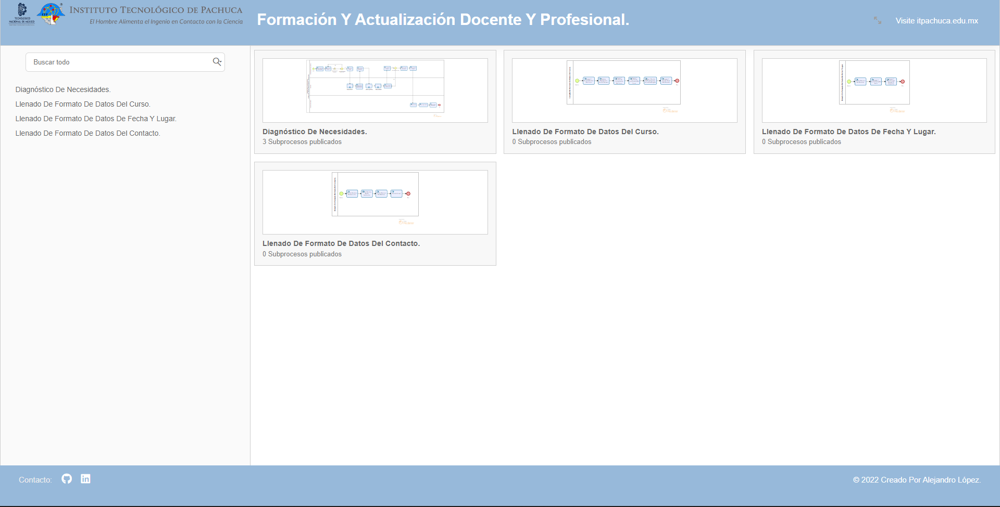

# <h1 align="center" style="color: #80cbc4;"> Proceso Para Formación Y Actualización Docente Y Profesional. 👨🏻‍💻 </h1> 
  

`Bizagi` es una suite ofimática con dos productos complementarios, un Modelador de Procesos y una Suite de BPM. `Bizagi` Process Modeler es un Freemium utilizado para diagramar, documentar y simular procesos usando la notación estándar BPMN.​ 
          

  

## 
 Requirements 

- [Bizagi Modeler](https://www.bizagi.com/es/plataforma/modeler) 

    

  

## 
 Screenshot Del Proyecto 💻 

🔶 [Project Website](https://alejandro-lopez.futuretecware.com/Formato-Para-El-Diagnostico-De-Necesidades/#list/)

